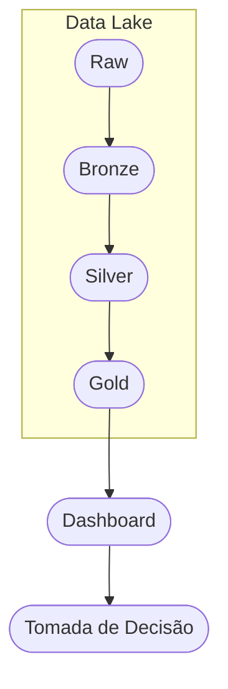

# Inteligência de Receita e Retenção

Plataforma de Analytics Engineering para Inteligência de Receita, Retenção de Clientes e Performance de Marketing utilizando PySpark, SQL e modelagem dimensional.

## Visão Geral

O projeto `revenue-retention-intelligence` foi estruturado como uma solução profissional de Analytics Engineering para um e-commerce D2C. A arquitetura segue o padrão Medallion para garantir governança, qualidade de dados e escalabilidade.

## Problema de Negócio

- Dados inconsistentes entre Marketing, Produto e Financeiro.
- Ausência de uma única fonte da verdade.
- Incapacidade de medir receita por canal.
- Dificuldade em mensurar churn.
- Elevados níveis de cancelamentos e devoluções.
- Métricas não padronizadas.

## Objetivos

- Criar uma base técnica consolidada para ingestão, limpeza, modelagem e validação.
- Estabelecer uma arquitetura robusta pronta para produção.
- Permitir evolução para análises de retenção, receita e churn.
- Garantir que a solução seja modular, testável e documentada.
- Atualizar automaticamente o pipeline com GitHub Actions.

## Arquitetura

A arquitetura adota o modelo Medallion:

- Raw: Dados brutos importados sem transformação.
- Bronze: Dados técnicos persistidos com ingestão e consistência mínima.
- Silver: Dados limpos, padronizados e integrados.
- Gold: Modelos analíticos e tabelas de fatos/dimensões prontos para consumo.
- Dashboard: Camada de visualização e tomada de decisão.



## Fluxo de Dados

1. Ingestão de CSVs brutos para `data/raw`.
2. Ingestão técnica para `data/bronze`.
3. Limpeza, padronização e integração para `data/silver`.
4. Construção de modelos e métricas para `data/gold`.
5. Dashboard e relatório executivo para tomada de decisão.

## Estrutura do Projeto

- `data/`: armazenagem de camadas Raw, Bronze, Silver e Gold.
- `src/`: código Python modular de pipeline e engenharia.
- `sql/`: scripts SQL de staging, marts e qualidade de dados.
- `notebooks/`: espaço para notebooks exploratórios e PoC.
- `dashboard/`: espaço reservado para artefatos Power BI.
- `docs/`: documentação de arquitetura, business discovery e métricas.
- `tests/`: testes unitários e de integração.
- `images/`: diagramas e arquitetura visual.

## Tecnologias Utilizadas

- Python
- PySpark
- SQL
- Git / GitHub
- Markdown
- Power BI (estrutura de pasta)
- VS Code

## Como Executar

1. Criar ambiente Python.
2. Instalar dependências:

```bash
pip install -r requirements.txt
```

3. Executar a orquestração principal:

```bash
python -m src.main
```

## KPIs

- Receita por canal
- Taxa de retenção de clientes
- Churn rate
- Impacto de cancelamentos e devoluções
- Qualidade dos dados por camada

## Roadmap

1. Implementar ingestão e persistência Bronze.
2. Implementar limpeza e regras de negócio Silver.
3. Definir tabelas Gold e métricas de receita e churn.
4. Criar pipelines automatizados e testes.
5. Desenvolver dashboards e relatórios executivos.

## Próximos Passos

- Adicionar mapeamento de esquemas e contratos.
- Construir testes de qualidade de dados automáticos.
- Integrar orquestrador como Airflow ou Dagster.
- Desenvolver parcelamento incremental e CDC.

## Melhorias Futuras

- Adicionar metadados e catálogo de dados.
- Suporte a múltiplas fontes de marketing e campanhas.
- Implementar lineage e monitoramento de dados.
- Publicar pipelines como Reusable Data Products.
